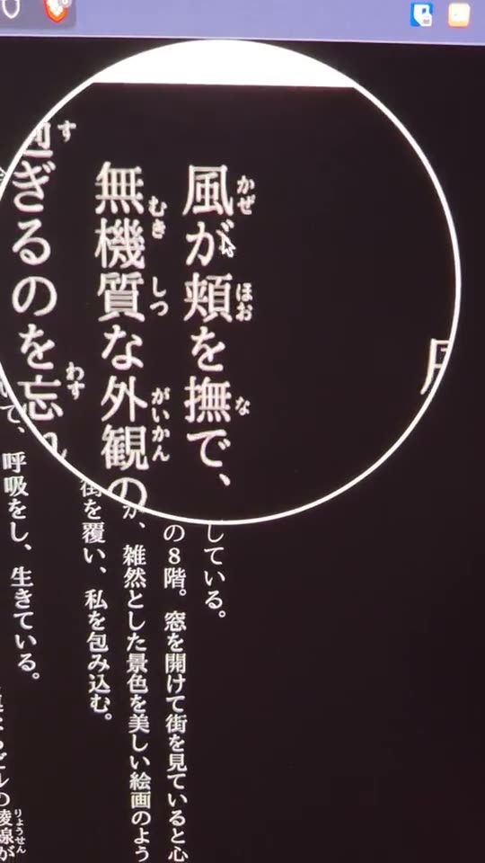

<p align="center">
  
</p>

# Frank Yomik

Read Japanese and Korean comics — and Japanese novels — in the original, and look up only what you stumble on. Frank Yomik detects speech bubbles with RT-DETR-v2, reads them with OCR, translates with a local LLM (Ollama) or annotates them with furigana, and shows the result through a magnifier you hold over the page. Everything runs on your own hardware.

<p align="center">
  
  &nbsp;&nbsp;
  
</p>
<p align="center"><em>Left: Japanese → English translation. Right: Furigana reading aids.</em></p>

## Hold to peek

The page is left exactly as the publisher drew it. Press and hold for 200ms and
a magnifier opens under your pointer, showing the same page with the
translation or the readings — release and it is gone. A quick tap still turns
the page, so the reader underneath keeps working as it always did.

<table>
<tr>
<td width="50%" align="center">
<a href="docs/media/lens-manga.mp4"></a>
<em>Manga: furigana over a balloon, 1.5x / 2x / 3x.<br><a href="docs/media/lens-manga.mp4">▶ play (20s)</a></em>
</td>
<td width="50%" align="center">
<a href="docs/media/lens-textbook.mp4"></a>
<em>Text books: furigana in the gutters of a Kindle novel.<br><a href="docs/media/lens-textbook.mp4">▶ play (20s)</a></em>
</td>
</tr>
</table>

Full-page replacement is still there as a mode, in both the app and the
extension, for when you would rather read the translation outright.

While a page is being translated, a small dot in the corner says where it is —
amber while it works, green once it can be peeked, red if it could not be
translated — with a few words on each change. Holding before a translation
arrives shows the magnifier as an empty ring rather than nothing, so waiting is
distinguishable from broken.

## Components

| Directory | Language | Description |
|-----------|----------|-------------|
| `server/` | Go + Python | API server, processing pipelines (manga, text books, webtoon), Redis worker |
| `client/` | Dart/Flutter | Android + Linux reader app with WebView overlay |
| `extension/` | JavaScript | Chromium MV3 extension for desktop Kindle/Naver reading |
| `docs/` | — | Test images, screenshots, demo videos (Git LFS), deployment notes |

## How It Works

**Manga pipeline** (Japanese → English or furigana):
```
Image → RT-DETR-v2 bubble detection → manga-ocr → Ollama translation → English render
                                                 → MeCab furigana    → Vertical JP render
```

**Text book pipeline** (Japanese novels → furigana):
```
Image → column detection (projection profile) → manga-ocr per ~12 glyphs
      → MeCab readings over the whole column  → furigana drawn in the gutters
```

Kindle rasterises reflowable novels the same way it renders manga — one image
per page, no text in the DOM — so a book is annotated as pixels too. What makes
prose tractable is its regularity: a page gives ~29 evenly spaced columns, and
a page that does not look like typeset prose is refused rather than annotated
as if it were.

**Webtoon pipeline** (Korean → English):
```
Image → EasyOCR text detection → cluster into bubbles → Ollama translation → color-aware render
```

**Web service**: Go API accepts images over HTTP, deduplicates via SHA256, queues through Redis Streams with priority ordering. Python workers process jobs and push results via Redis Pub/Sub + WebSocket.

The protected debug API can also store original/translated page pairs uploaded from the Chromium extension. List recent pairs with `GET /api/v1/debug/pages`.

**Flutter client**: Wraps Kindle (read.amazon.co.jp) and Naver Webtoon in a WebView, captures pages, submits them to the API, and reveals the translation through a magnifier lens — the original page stays on screen and a 200ms press-and-hold peeks at the translated render underneath (1.5x/2x/3x), with full-page replacement available as a mode. The Chromium extension presents translations the same way. Supports auto-translate or manual translate-on-demand, per-volume pipeline selection (furigana vs English), and local SQLite caching. Each Kindle volume remembers its own pipeline, so moving between a manga and a novel needs no setting changes.

**Chromium extension**: Runs on desktop Chrome/Chromium, Brave, and Edge. It keeps Kindle and Naver pages visually close to stock: the content script detects the current page image, sends it to your self-hosted server, and reveals the result through the same hold-to-peek magnifier. All settings live in the extension popup; the bearer token stays in the extension service worker and is never exposed to page scripts.

<p align="center">
  
</p>
<p align="center"><em>Desktop extension configured for a self-hosted server, with Kindle manga running behind it.</em></p>

## Requirements

- Python 3.12+
- [Ollama](https://ollama.ai) with `qwen3:14b` (~9 GB VRAM)
- Go 1.25+
- Redis
- Flutter 3.11+ (for the client app)

## Setup

```bash
git clone https://github.com/akitaonrails/FrankYomik.git
cd FrankYomik/server

python -m venv .venv
source .venv/bin/activate
pip install -r requirements.txt

ollama pull qwen3:14b
```

## CLI Usage

Run from `server/`:

```bash
# Manga: add furigana readings
python process_manga.py furigana

# Manga: translate to English
python process_manga.py translate

# Both + debug bounding boxes
python process_manga.py all --debug

# Webtoon: download and translate a Naver Webtoon chapter
python process_webtoon.py pipeline <URL>
```

Input: `docs/adult*.png` (furigana), `docs/shounen*.png` (translation).
Output: `output/furigana/`, `output/translate/`.

## Web Service

### Local

```bash
# Terminal 1
redis-server

# Terminal 2
cd server && AUTH_TOKEN=secret go run .

# Terminal 3
cd server && python -m worker --pipeline both
```

### Docker Compose

```bash
# Set auth token
echo "AUTH_TOKEN=mysecret" > .env

# Optionally set UID/GID to match your host user (default 1026)
echo "APP_UID=$(id -u)" >> .env
echo "APP_GID=$(id -g)" >> .env

# Build and start
docker compose up -d

# Check status
docker compose logs -f worker
curl -H "Authorization: Bearer mysecret" http://localhost:8080/api/v1/health
```

### Submit a Job

```bash
curl -X POST -H "Authorization: Bearer secret" \
  -F "image=@docs/shounen.png" \
  -F "pipeline=manga_translate" \
  http://localhost:8080/api/v1/jobs

# Poll status
curl -H "Authorization: Bearer secret" http://localhost:8080/api/v1/jobs/<job_id>

# Download result
curl -H "Authorization: Bearer secret" http://localhost:8080/api/v1/jobs/<job_id>/image -o result.png
```

## API

| Method | Path | Description |
|--------|------|-------------|
| POST | `/api/v1/jobs` | Upload image, returns `job_id` |
| GET | `/api/v1/jobs/:id` | Poll job status and metadata |
| GET | `/api/v1/jobs/:id/image` | Download processed image |
| DELETE | `/api/v1/jobs/:id` | Cancel/delete a job |
| GET | `/api/v1/health` | Server + worker + queue status |
| WS | `/api/v1/ws` | Real-time result push |

All endpoints except `/health` require `Authorization: Bearer <token>`.

Pipelines: `manga_translate`, `manga_furigana`, `book_furigana`, `webtoon`. Priority: `high` (default) or `low` (prefetch).

## Cloudflare Tunnel (Remote Access)

Expose the API over HTTPS via [Cloudflare Tunnel](https://developers.cloudflare.com/cloudflare-one/connections/connect-networks/) so the Flutter client can reach it from anywhere.

### One-time setup

```bash
# Install cloudflared
# Arch: pacman -S cloudflared
# Debian/Ubuntu: see https://developers.cloudflare.com/cloudflare-one/connections/connect-networks/downloads/

# Authenticate with Cloudflare (opens browser)
cloudflared tunnel login

# Create a tunnel
cloudflared tunnel create <tunnel-name>

# Route DNS (requires a domain managed by Cloudflare)
cloudflared tunnel route dns <tunnel-name> <your-hostname>
```

### Configure

Create `.cloudflared/config.yml` in the project root:

```yaml
tunnel: <TUNNEL_UUID>
credentials-file: /etc/cloudflared/<TUNNEL_UUID>.json

ingress:
  - hostname: <your-hostname>
    service: http://api:8080
  - service: http_status:404
```

Copy your tunnel credentials JSON from `~/.cloudflared/<TUNNEL_UUID>.json` into `.cloudflared/`.

### Run with Docker Compose

The `docker-compose.yml` includes `init-cloudflared` and `cloudflared` services. The init container copies credentials from `.cloudflared/` into a Docker volume (avoids filesystem permission issues with NFS or restrictive mounts), then cloudflared connects the tunnel.

```bash
docker compose up -d
```

The API is now reachable at `https://<your-hostname>`. Configure this URL in the Flutter client's Settings screen.

## Flutter Client

```bash
cd client
flutter pub get
flutter run -d linux       # Desktop
flutter run -d <device>    # Android

# Build release APK
flutter build apk --release
```

The client defaults to `http://localhost:8080`. Configure the server URL and auth token in the Settings screen.

## Chromium Extension

The desktop extension is the lightest way to use Frank Yomik directly on the Kindle Japan reader and Naver Webtoon sites. It supports:

- Kindle Japan: `read.amazon.co.jp`, `read.kindle.co.jp`
- Naver Webtoon: `comic.naver.com`, `m.comic.naver.com`
- Kindle pipelines: English translation, furigana, or furigana for text books
- Webtoon pipeline: Korean → English
- A pipeline per volume: a novel and a manga each keep their own, so switching books changes nothing
- Reading mode (lens or full page) and lens magnification
- Per-site enable/disable, target-language selection, and webtoon prefetch settings
- Manual force-reprocess and original-vs-translated debug pair upload from the popup

Debug uploads are stored server-side and can be listed with `GET /api/v1/debug/pages`.

### Manual install from a GitHub release

The extension is distributed as a zip asset on the [latest release](https://github.com/akitaonrails/FrankYomik/releases/latest). Chromium does not install this zip directly; load the extracted folder as an unpacked extension:

1. Download `frank-yomik-extension-*.zip` from the latest release assets.
2. Unzip it into a permanent folder, for example `~/Applications/frank-yomik-extension/`. Do not delete this folder after loading it.
3. Open your browser's extension page:
   - Chrome/Chromium/Brave: `chrome://extensions`
   - Edge: `edge://extensions`
4. Enable **Developer mode**.
5. Click **Load unpacked** and select the extracted folder that contains `manifest.json`.
6. Pin/open the **Frank Yomik** extension action.
7. Set the API base URL, auth token, sites, Kindle pipeline, and target language. Settings autosave when you leave a field; **Save now** is available as a fallback and may trigger the exact API-origin permission prompt.
8. Click **Check server**.
9. Reload any Kindle/Naver tabs that were already open.

To update, download the newer release zip, replace the extracted folder contents, then click the reload button on the extension card in `chrome://extensions`. If you remove and re-add the extension, export settings first because Chromium may clear extension storage.

### Versioning

The Android `versionCode` is derived from `git rev-list --count HEAD` (in `build.gradle.kts`), so every commit automatically produces a higher build number. You only need to bump the display version (`version: X.Y.Z` in `pubspec.yaml`) for releases — the build number takes care of itself.

### Android Sideloading

The APK is distributed directly (not via Google Play) because the app requires a locally-running server with GPU access — it's not a standalone app. To install on Android:

1. Transfer the APK to your phone
2. Enable **Install from unknown sources** for your file manager (Settings → Apps → Special access → Install unknown apps)
3. On Samsung devices, also disable **Auto Blocker** (Settings → Security → Auto Blocker)

This is a one-time setup. Future updates signed with the same key install without prompts.

## Testing

```bash
cd server

# Python unit tests (444 tests)
.venv/bin/pytest tests/unit/ -v

# Python integration tests (34 tests, needs test images in docs/)
.venv/bin/pytest tests/integration/ -v

# Go API tests (needs Redis for full coverage, skips gracefully without it)
go test -v .

# Flutter tests (82 tests; the lens suite needs node)
cd ../client && flutter test

# Chromium extension (134 unit + 14 browser tests, plus manifest validation)
cd ../extension && npm test
```

The extension's browser tests drive a real headless Chromium over the DevTools
protocol — no dependencies, and skipped automatically where no Chromium is
installed. They cover the things a DOM stub cannot judge: whether the reader's
own handlers still fire during a peek, whether a page and its translation are
recognised as the same page once reduced to a signature, and whether the status
indicator can actually be seen.

## Configuration

All settings in `server/config.yaml`:

| Section | Controls |
|---------|----------|
| `ollama` | Model, URL, temperature, think mode |
| `fonts` | Japanese, English, SFX font paths |
| `ocr` | Device (cpu/cuda) for manga-ocr |
| `text_detection` | EasyOCR confidence and GPU for artwork text |
| `manga_inpainting` | LaMa text removal (off by default) |
| `book` | Text-book render scale and OCR chunk size |
| `webtoon` | Scraper, OCR, bubble detection, inpainting |
| `worker` | Redis, consumer group, heartbeat, timeout |

## License

- `server/` — [GNU Affero General Public License v3.0](LICENSE) (AGPL-3.0)
- `client/` — [GNU General Public License v3.0](client/LICENSE) (GPL-3.0)
